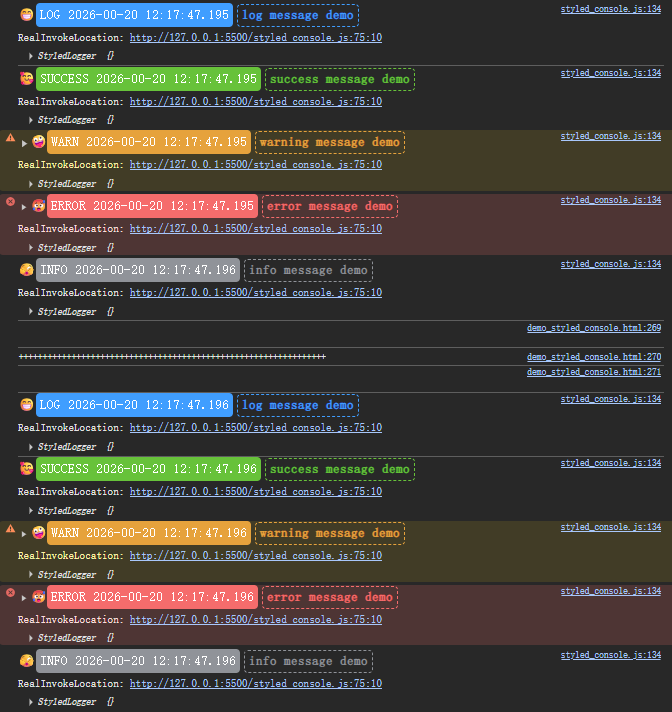

# 带样式的console

一个带有样式化的控制台日志工具，提供美观的日志输出格式，包括时间戳、图标和自定义样式。



## 特性

- 🎨 **样式化输出** - 为不同类型的日志提供独特的颜色和图标
- ⏰ **时间戳** - 自动显示日志记录的准确时间
- 🔍 **调用位置追踪** - 显示实际调用日志的位置
- 🔄 **覆盖/恢复原始控制台** - 可以覆盖原生 `console` 方法并在需要时恢复
- 🛠️ **可定制样式** - 支持自定义各种日志类型的样式
- 💡 **提示文本** - 支持在日志中添加特殊标记的提示文本（以 `##` 开头）

## 安装

```bash
npm install ares-styled-logger
```

## 使用方法

### 基本使用

```typescript
import { StyledLogger } from 'ares-styled-logger';

// 创建实例并使用（所有方法都是实例方法）
const logger = new StyledLogger();
logger.log('这是一个普通日志');
logger.success('这是一个成功日志');
logger.warn('这是一个警告日志');
logger.error('这是一个错误日志');
logger.info('这是一个信息日志');
logger.debug('这是一个调试日志');

// 使用提示文本（以 ## 开头的字符串会被特殊处理）
logger.success('##操作完成', '其他参数...');
```

### 覆盖原生控制台

```typescript
import { StyledLogger } from 'ares-styled-logger';

// 创建实例并覆盖原生控制台方法
const logger = new StyledLogger();
logger.overrideOriginalLogger();

// 现在可以使用原生 console 方法，但会以样式化的方式输出
console.log('普通日志');
console.success('成功日志');
console.warn('警告日志');
console.error('错误日志');
console.info('信息日志');
console.debug('调试日志');

// 恢复原生控制台方法
logger.restoreOriginalLogger();
```

### 自定义样式配置

```typescript
import { StyledLogger } from 'ares-styled-logger';

// 样式配置示例
const styleConfigDemo = {
  log: {
    prefixStyle: 'background: #409EFF; color: white; border-radius: 5px; padding: 0 5px; line-height: 30px; height: 30px; font-size: 16px;',
    prefixText: 'LOG',
    icon: '😁',
    iconStyle: 'line-height: 30px; height: 30px; font-size: 16px;',
    tipStyle: 'color: #409EFF; border-color: #409EFF; border: 2px dashed; margin-left: 5px; border-radius: 5px; padding: 0 5px; line-height: 26px; height: 26px; font-size: 16px; font-weight: bold;',
    realInvokeLocationStyle: 'padding: 5px 0; font-size: 14px;'
  },
  success: {
    prefixStyle: 'background: #67C23A; color: white; border-radius: 5px; padding: 0 5px; line-height: 30px; height: 30px; font-size: 16px;',
    prefixText: 'SUCCESS',
    icon: '🥰',
    iconStyle: 'line-height: 30px; height: 30px; font-size: 16px;',
    tipStyle: 'color: #67C23A; border-color: #67C23A; border: 2px dashed; margin-left: 5px; border-radius: 5px; padding: 0 5px; line-height: 26px; height: 26px; font-size: 16px; font-weight: bold;',
    realInvokeLocationStyle: 'padding: 5px 0; font-size: 14px;'
  },
  warn: {
    prefixStyle: 'background: #E6A23C; color: white; border-radius: 5px; padding: 0 5px; line-height: 30px; height: 30px; font-size: 16px;',
    prefixText: 'WARN',
    icon: '🤪',
    iconStyle: 'line-height: 30px; height: 30px; font-size: 16px;',
    tipStyle: 'color: #E6A23C; border-color: #E6A23C; border: 2px dashed; margin-left: 5px; border-radius: 5px; padding: 0 5px; line-height: 26px; height: 26px; font-size: 16px; font-weight: bold;',
    realInvokeLocationStyle: 'padding: 5px 0; font-size: 14px;'
  },
  error: {
    prefixStyle: 'background: #F56C6C; color: white; border-radius: 5px; padding: 0 5px; line-height: 30px; height: 30px; font-size: 16px;',
    prefixText: 'ERROR',
    icon: '🥵',
    iconStyle: 'line-height: 30px; height: 30px; font-size: 16px;',
    tipStyle: 'color: #F56C6C; border-color: #F56C6C; border: 2px dashed; margin-left: 5px; border-radius: 5px; padding: 0 5px; line-height: 26px; height: 26px; font-size: 16px; font-weight: bold;',
    realInvokeLocationStyle: 'padding: 5px 0; font-size: 14px;'
  },
  info: {
    prefixStyle: 'background: #909399; color: white; border-radius: 5px; padding: 0 5px; line-height: 30px; height: 30px; font-size: 16px;',
    prefixText: 'INFO',
    icon: '🫣',
    iconStyle: 'line-height: 30px; height: 30px; font-size: 16px;',
    tipStyle: 'color: #909399; border-color: #909399; border: 2px dashed; margin-left: 5px; border-radius: 5px; padding: 0 5px; line-height: 26px; height: 26px; font-size: 16px; font-weight: bold;',
    realInvokeLocationStyle: 'padding: 5px 0; font-size: 14px;'
  },
  debug: {
    prefixStyle: 'background: #EE82EE; color: white; border-radius: 5px; padding: 0 5px; line-height: 30px; height: 30px; font-size: 16px;',
    prefixText: 'DEBUG',
    icon: '🧐',
    iconStyle: 'line-height: 30px; height: 30px; font-size: 16px;',
    tipStyle: 'color: #EE82EE; border-color: #EE82EE; border: 2px dashed; margin-left: 5px; border-radius: 5px; padding: 0 5px; line-height: 26px; height: 26px; font-size: 16px; font-weight: bold;',
    realInvokeLocationStyle: 'padding: 5px 0; font-size: 14px;'
  }
};

// 自定义样式配置（只修改部分属性）
const customStyleConfig = {
  log: {
    icon: '📝',  // 修改普通日志的图标
    prefixText: 'INFO', // 修改前缀文字
  },
  error: {
    icon: '❌',  // 修改错误类型的图标
    prefixStyle: 'background: red; color: white; border-radius: 5px; padding: 0 5px; line-height: 30px; height: 30px; font-size: 16px;',
  }
};

// 应用自定义配置
const logger = new StyledLogger(customStyleConfig);
```

### 深度合并配置

当应用自定义样式配置时，系统会使用深度合并算法来融合默认配置和自定义配置，这意味着你只需要提供需要更改的部分即可，不需要覆盖整个配置对象。

```javascript
// 仅更改部分属性，其余保持默认值
const partialConfig = {
  error: {
    icon: '❌',  // 仅更改错误类型的图标
    // 其他属性如 prefixStyle、prefixText 等仍使用默认值
  }
};

const logger = new StyledLogger(partialConfig);
```

## 日志类型

| 类型 | 图标 | 颜色 | 用途 |
|------|------|------|------|
| log | 😁 | 蓝色 | 普通日志信息 |
| success | 🥰 | 绿色 | 成功状态 |
| warn | 🤪 | 橙色 | 警告信息 |
| error | 🥵 | 红色 | 错误信息 |
| info | 🫣 | 灰色 | 信息提示 |
| debug | 🧐 | 紫色 | 调试信息 |

### 公共实例方法

- `logger.log(...args)` - 输出普通日志
- `logger.success(...args)` - 输出成功日志
- `logger.warn(...args)` - 输出警告日志
- `logger.error(...args)` - 输出错误日志
- `logger.info(...args)` - 输出信息日志
- `logger.debug(...args)` - 输出调试日志
- `logger.overrideOriginalLogger()` - 覆盖原生 console 方法
- `logger.restoreOriginalLogger()` - 恢复原生 console 方法
- `logger.updateStyleConfig(config)` - 更新当前实例的样式配置

### 私有方法（仅供内部使用）

以下方法是类的私有方法，不应在外部直接调用：

- `#invokeLogger(type, ...args)` - 调用指定类型的日志方法
- `#getRealInvokeLocation()` - 获取实际调用位置
- `#getFormattedTime()` - 获取格式化时间

### 私有属性（仅供内部使用）

以下属性是类的私有属性，不应在外部直接访问：

- `#originalConsole` - 存储原始 console 方法的备份
- `#styleConfig` - 存储当前样式配置

### 提示文本功能

如果第一个参数是以 `##` 开头的字符串，则该字符串会被识别为提示文本，并以特殊样式显示：

```javascript
logger.success('##操作已完成', '更多日志内容...');
```

## 浏览器兼容性

支持现代浏览器，需要支持 `console` API、ES5+ 语法以及 `Error.stack` 属性。注意：私有字段和私有方法需要 ES2022 或更高版本的支持。

## 贡献

欢迎提交 Issue 和 Pull Request 来改进此项目。

## 许可证

MIT
